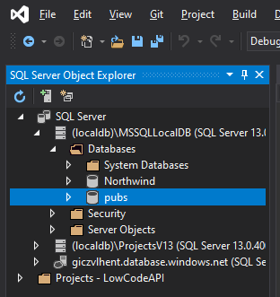

# Low Code API

LowCodeAPI is a set of .NET 5 classes and interfaces that reduce the amount of boilerplate code necessary for any ASP.NET web project.

## Sample App

This repo not only has the generic files you will need, but also a sample Blazor WebAssembly app. You do not need to run the Sample App to use the framework. If you just want to get to the goods, skip over the steps to run the sample app.

### Sample App Instructions:

#### Step 1 - Create a "pubs" database in LocalDB



Use the **SQL Server Object Explorer** (or your favorite SQL Manager) to create a new database called "pubs"

#### Step 2 - Execute the *pubs.sql* script to generate the database

This script is in the repo, and was downloaded from https://github.com/microsoft/sql-server-samples/blob/master/samples/databases/northwind-pubs/instpubs.sql

#### Option - Generate the models and dbContext in your own app

The sample app already has the models and dbContext, but if you want to generate them for your own project, you can follow the instructions at https://docs.microsoft.com/en-us/ef/core/cli/dotnet

- Make sure you have these packages in your Client project's *.csproj* file:

  ```
  <PackageReference Include="Microsoft.EntityFrameworkCore.SqlServer" Version="5.0.0" />
  <PackageReference Include="Microsoft.EntityFrameworkCore.Tools" Version="5.0.0" />
  <PackageReference Include="Microsoft.VisualStudio.Web.CodeGeneration.Design" Version="5.0.0" />
  ```

- Open a command window and execute this command: 

  ```
  dotnet ef dbcontext scaffold "Data Source=(localdb)\MSSQLLocalDB;Initial Catalog=pubs" 
  Microsoft.EntityFrameworkCore.SqlServer --context-dir Data --output-dir Models
  ```

- If you get an error you may need to install the dotnet-ef CLI tool:

  ```
  dotnet tool install --global dotnet-ef
  ```

- Move the *Models* folder and the model files out of the *Server* project and into the *Shared* project.

- Rename the namespaces in each model accordingly.

- Rename the models namespace in the `dbContext` file (*pubsContext.cs*).

## LowCodeAPI Required Files

Once you have a project with models and a `dbContext`, you can start building out the API Layer. The following files are not model or dbContext-specific. 

### IRepository.cs

Everything starts with this interface, which goes in the *Shared* project's *Models* folder

```c#
using System;
using System.Collections.Generic;
using System.Linq;
using System.Linq.Expressions;
using System.Text;
using System.Threading.Tasks;

namespace LowCodeAPI.Shared.Models
{
    public interface IRepository<TEntity> where TEntity : class
    {
        Task<IEnumerable<TEntity>> GetAll();
        Task<IEnumerable<TEntity>> Get(
            Expression<Func<TEntity, bool>> filter = null,
            Func<IQueryable<TEntity>, IOrderedQueryable<TEntity>> orderBy = null,
            string includeProperties = "");
        Task<TEntity> Insert(TEntity entity);
        Task<TEntity> Update(TEntity entityToUpdate);
        Task<bool> Delete(TEntity entityToDelete);
    }
}
```

The `IRepository` interface has everything you need for basic CRUD actions. It is generic, accepting an entity type `TEntity`.

### EFRepository.cs

This is an implementation of `IRepository` that uses an Entity Framework dbContext. It can be re-used for any dbContext and entity. This goes in the *Server* project's *Data* folder.

```c#
using Microsoft.EntityFrameworkCore;
using LowCodeAPI.Shared.Models;
using System;
using System.Collections.Generic;
using System.Linq;
using System.Linq.Expressions;
using System.Threading.Tasks;

namespace LowCodeAPI.Server.Data
{
    public class EFRepository<TEntity, TDataContext> : IRepository<TEntity>
        where TEntity : class
        where TDataContext : DbContext
    {
        protected readonly TDataContext context;
        internal DbSet<TEntity> dbSet;

        public EFRepository(TDataContext dataContext)
        {
            context = dataContext;
            context.ChangeTracker.QueryTrackingBehavior = QueryTrackingBehavior.NoTracking;
            dbSet = context.Set<TEntity>();
        }

        public virtual async Task<IEnumerable<TEntity>> GetAll()
        {
            await Task.Delay(1);
            return dbSet;
        }

        public virtual async Task<IEnumerable<TEntity>> Get(Expression<Func<TEntity, bool>> filter = null, Func<IQueryable<TEntity>, IOrderedQueryable<TEntity>> orderBy = null, string includeProperties = "")
        {
            try
            {
                // Get the dbSet from the Entity passed in                
                IQueryable<TEntity> query = dbSet;

                // Apply the filter
                if (filter != null)
                {
                    query = query.Where(filter);
                }

                // Include the specified properties
                foreach (var includeProperty in includeProperties.Split
                    (new char[] { ',' }, StringSplitOptions.RemoveEmptyEntries))
                {
                    query = query.Include(includeProperty);
                }

                // Sort
                if (orderBy != null)
                {
                    return orderBy(query).ToList();
                }
                else
                {
                    return await query.ToListAsync();
                }
            }
            catch (Exception ex)
            {
                var msg = ex.Message;
                return null;
            }
        }

        public virtual async Task<TEntity> Insert(TEntity entity)
        {
            await dbSet.AddAsync(entity);
            await context.SaveChangesAsync();
            return entity;
        }

        public virtual async Task<TEntity> Update(TEntity entityToUpdate)
        {
            var dbSet = context.Set<TEntity>();
            dbSet.Attach(entityToUpdate);
            context.Entry(entityToUpdate).State = EntityState.Modified;
            await context.SaveChangesAsync();
            return entityToUpdate;
        }

        public virtual async Task<bool> Delete(TEntity entityToDelete)
        {
            if (context.Entry(entityToDelete).State == EntityState.Detached)
            {
                dbSet.Attach(entityToDelete);
            }
            dbSet.Remove(entityToDelete);
            return await context.SaveChangesAsync() >= 1;
        }
    }
}
```

### APIEntityResponse.cs

This class is returned by any API Controller Endpoint that returns a single entity. It exists in the *Shared* project's *Models* folder.

```c#
using System;
using System.Collections.Generic;
using System.Text;

namespace LowCodeAPI.Shared.Models
{
    public class APIEntityResponse<TEntity> where TEntity : class
    {
        public bool Success { get; set; }
        public List<string> ErrorMessages { get; set; } = new List<string>();
        public TEntity Data { get; set; }
    }
}
```

### APIListOfEntityResponse.cs

This class is returned by any API Controller Endpoint that returns a list of entities. It exists in the *Shared* project's *Models* folder.

```c#
using System;
using System.Collections.Generic;
using System.Text;

namespace LowCodeAPI.Shared.Models
{
    public class APIListOfEntityResponse<TEntity> where TEntity : class
    {
        public bool Success { get; set; }
        public List<string> ErrorMessages { get; set; } = new List<string>();
        public IEnumerable<TEntity> Data { get; set; }
    }
}
```

### EFControllerBase.cs

This base class is used for all API Controllers that are based on a model (`TEntity`). Note that there are two endpoints not in the `IRepository` interface, `GetByValue` and `SearchByValue`. The fact is, we can't use the `IRepository` interface, because the return types are specific to API endpoints: `APIEntityResponse` and `APIListOfEntityResponse`.  

```c#
using LowCodeAPI.Server.Data;
using LowCodeAPI.Shared.Models;
using Microsoft.AspNetCore.Mvc;
using Microsoft.EntityFrameworkCore;
using System;
using System.Collections.Generic;
using System.Linq;
using System.Threading.Tasks;

namespace LowCodeAPI.Server.Controllers
{
    public class EFControllerBase<TEntity, TDataContext> : ControllerBase 
        where TEntity: class
        where TDataContext : DbContext
    {
        private EFRepository<TEntity, TDataContext> repository;

        public EFControllerBase(EFRepository<TEntity, TDataContext> _repository)
        {
            repository = _repository;
        }

        [HttpGet]
        public async Task<ActionResult<APIListOfEntityResponse<TEntity>>> GetAll()
        {
            try
            {
                var result = await repository.GetAll();
                return Ok(new APIListOfEntityResponse<TEntity>()
                {
                    Success = true,
                    Data = result
                });
            }
            catch (Exception ex)
            {
                // log exception here
                return StatusCode(500);
            }
        }

        [HttpGet("{PropertyName}/{Value}/GetByValue")]
        public async Task<ActionResult<APIEntityResponse<TEntity>>> GetByValue(string PropertyName, string Value)
        {
            
            await Task.Delay(0);
            try
            {
                var IdProperty = typeof(TEntity).GetProperty(PropertyName);
                var result = (from x in repository.dbSet.ToList()
                              where IdProperty.GetValue(x).ToString().ToLower() == Value.ToLower() 
                              select x).FirstOrDefault();
                if (result != null)
                {
                    return Ok(new APIEntityResponse<TEntity>()
                    {
                        Success = true,
                        Data = result
                    });
                }
                else
                {
                    return Ok(new APIEntityResponse<TEntity>()
                    {
                        Success = false,
                        ErrorMessages = new List<string>() { "Entity Not Found" },
                        Data = null
                    });
                }
            }
            catch (Exception ex)
            {
                // log exception here
                return StatusCode(500);
            }
        }

        [HttpGet("{PropertyName}/{Value}/SearchByValue")]
        public async Task<ActionResult<APIListOfEntityResponse<TEntity>>> SearchByValue(string PropertyName, string Value)
        {
            await Task.Delay(0);
            try
            {
                var IdProperty = typeof(TEntity).GetProperty(PropertyName);
                var result = (from x in repository.dbSet.ToList() 
                              where IdProperty.GetValue(x).ToString().ToLower().Contains(Value.ToLower()) 
                              select x);
                if (result != null)
                {
                    return Ok(new APIListOfEntityResponse<TEntity>()
                    {
                        Success = true,
                        Data = result
                    });
                }
                else
                {
                    return Ok(new APIListOfEntityResponse<TEntity>()
                    {
                        Success = false,
                        ErrorMessages = new List<string>() { "No Entities Found" },
                        Data = null
                    });
                }
            }
            catch (Exception ex)
            {
                // log exception here
                return StatusCode(500);
            }
        }

        [HttpPost]
        public async Task<ActionResult<APIEntityResponse<TEntity>>> Post([FromBody] TEntity Entity)
        {
            try
            {
                await repository.Insert(Entity);
                return Ok(new APIEntityResponse<TEntity>()
                {
                    Success = true,
                    Data = Entity
                });
            }
            catch (Exception ex)
            {
                // log exception here
                return StatusCode(500);
            }
        }

        [HttpPut]
        public async Task<ActionResult<APIEntityResponse<TEntity>>> Put([FromBody] TEntity Entity)
        {
            try
            {
                await repository.Update(Entity);
                return Ok(new APIEntityResponse<TEntity>()
                {
                    Success = true,
                    Data = Entity
                });
            }
            catch (Exception ex)
            {
                // log exception here
                return StatusCode(500);
            }
        }

        [HttpDelete("{PropertyName}/{Value}/DeleteByValue")]
        public async Task<ActionResult> DeleteByValue(string PropertyName, string Value)
        {
            try
            {
                var IdProperty = typeof(TEntity).GetProperty(PropertyName);
                var entity = (from x in repository.dbSet.ToList()
                              where IdProperty.GetValue(x).ToString() == Value
                              select x).FirstOrDefault();

                if (entity != null)
                {
                    await repository.Delete(entity);
                    return NoContent();
                }
                else
                {
                    return StatusCode(500);
                }
            }
            catch (Exception ex)
            {
                // log exception here
                var msg = ex.Message;
                return StatusCode(500);
            }
        }
    }
}
```

### APIRepository.cs

This implementation of `IRepository` goes in the *Client* project's *Services* folder. It can be re-used to access any controller.

```c#
using System;
using System.Collections.Generic;
using System.Threading.Tasks;
using LowCodeAPI.Shared.Models;
using System.Net.Http;
using System.Net.Http.Json;
using Newtonsoft.Json;
using System.Net;
using System.Linq.Expressions;
using System.Linq;

namespace LowCodeAPI.Client.Services
{
    /// <summary>
    /// Reusable API Repository base class that provides access to CRUD APIs
    /// </summary>
    /// <typeparam name="TEntity"></typeparam>
    public class APIRepository<TEntity> : IRepository<TEntity> 
        where TEntity : class
    {
        string controllerName;
        string primaryKeyName;
        HttpClient http;

        public APIRepository(HttpClient _http, string _controllerName, string _primaryKeyName)
        {
            http = _http;
            controllerName = _controllerName;
            primaryKeyName = _primaryKeyName;
        }


        public async Task<IEnumerable<TEntity>> GetAll()
        {
            try
            {
                var result = await http.GetAsync(controllerName);
                result.EnsureSuccessStatusCode();
                string responseBody = await result.Content.ReadAsStringAsync();
                var response = JsonConvert.DeserializeObject<APIListOfEntityResponse<TEntity>>(responseBody);
                if (response.Success)
                    return response.Data;
                else
                    return new List<TEntity>();
            }
            catch (Exception ex)
            {
                var msg = ex.Message;
                return null;
            }
        }

        public Task<IEnumerable<TEntity>> Get(Expression<Func<TEntity, bool>> filter = null, Func<IQueryable<TEntity>, IOrderedQueryable<TEntity>> orderBy = null, string includeProperties = "")
        {
            throw new NotImplementedException();
        }

        public async Task<TEntity> GetByValue(string PropertyName, string Value)
        {
            try
            {
                
                var url = $"{controllerName}/{WebUtility.HtmlEncode(PropertyName)}/{WebUtility.HtmlEncode(Value)}/GetByValue";
                var result = await http.GetAsync(url);
                result.EnsureSuccessStatusCode();
                string responseBody = await result.Content.ReadAsStringAsync();
                var response = JsonConvert.DeserializeObject<APIEntityResponse<TEntity>>(responseBody);
                if (response.Success)
                    return response.Data;
                else
                    return null;
            }
            catch (Exception ex)
            {
                var msg = ex.Message;
                return null;
            }
        }

        public async Task<IEnumerable<TEntity>> SearchByValue(string PropertyName, string Value)
        {
            try
            {
                var url = $"{controllerName}/{WebUtility.HtmlEncode(PropertyName)}/{WebUtility.HtmlEncode(Value)}/SearchByValue";
                var result = await http.GetAsync(url);
                result.EnsureSuccessStatusCode();
                string responseBody = await result.Content.ReadAsStringAsync();
                var response = JsonConvert.DeserializeObject<APIListOfEntityResponse<TEntity>>(responseBody);
                if (response.Success)
                    return response.Data;
                else
                    return null;
            }
            catch (Exception ex)
            {
                var msg = ex.Message;
                return null;
            }
        }

        public async Task<TEntity> Insert(TEntity entity)
        {
            try
            {
                var result = await http.PostAsJsonAsync(controllerName, entity);
                result.EnsureSuccessStatusCode();
                string responseBody = await result.Content.ReadAsStringAsync();
                var response = JsonConvert.DeserializeObject<APIEntityResponse<TEntity>>(responseBody);
                if (response.Success)
                    return response.Data;
                else
                    return null;
            }
            catch (Exception ex)
            {
                return null;
            }
        }

        public async Task<TEntity> Update(TEntity entityToUpdate)
        {
            try
            {
                var result = await http.PutAsJsonAsync(controllerName, entityToUpdate);
                result.EnsureSuccessStatusCode();
                string responseBody = await result.Content.ReadAsStringAsync();
                var response = JsonConvert.DeserializeObject<APIEntityResponse<TEntity>>(responseBody);
                if (response.Success)
                    return response.Data;
                else
                    return null;
            }
            catch (Exception ex)
            {
                return null;
            }
        }

        public async Task<bool> Delete(TEntity entityToDelete)
        {
            try
            {
                var value = entityToDelete.GetType()
                    .GetProperty(primaryKeyName)
                    .GetValue(entityToDelete, null)
                    .ToString();

                return await DeleteByValue(primaryKeyName, value);
            }
            catch (Exception ex)
            {
                return false;
            }
        }

        public async Task<bool> DeleteByValue(string PropertyName, string Value)
        {
            try
            {
                var url = $"{controllerName}/{WebUtility.HtmlEncode(PropertyName)}/{WebUtility.HtmlEncode(Value)}/DeleteByValue";
                var result = await http.DeleteAsync(url);
                result.EnsureSuccessStatusCode();
                return true;
            }
            catch (Exception ex)
            {
                return false;
            }
        }

    }
}
```

## Server-Side Configuration

### Creating a Controller

To create a new API Controller from an entity (and `dbContext`), it looks like this:

*AuthorsController.cs*:

```c#
using LowCodeAPI.Server.Data;
using LowCodeAPI.Shared.Models;
using Microsoft.AspNetCore.Mvc;
using System;
using System.Collections.Generic;
using System.Linq;
using System.Threading.Tasks;

namespace LowCodeAPI.Server.Controllers
{
    [Route("[controller]")]
    [ApiController]
    public class AuthorsController : EFControllerBase<Authors, pubsContext>
    {
        EFRepository<Authors, pubsContext> repository;

        public AuthorsController(EFRepository<Authors, pubsContext> _repository) 
            : base(_repository)
        {
            repository = _repository;
        }
        
    }
}
```

Just inherit `EFControllerBase<TEntity, TDataContext>`, inject an `EFRepository<TEntity, TDataContext>`, and pass the repository into the `base` constructor. You can add your own endpoints using the repository.

### Add to Startup.ConfigureServices()

To the *Server* projects' *Startup.cs* file, add the `dbContext`, and an `EFRepository` for each model you want a controller for as `Transient` services"."

```c#
public void ConfigureServices(IServiceCollection services)
{
    // First, add the dbContext
    services.AddTransient<pubsContext, pubsContext>();

    // Next, add an EFRepository for each model you want a controller for
    services.AddTransient<EFRepository<Authors, pubsContext>>();

    services.AddControllersWithViews();
    services.AddRazorPages();
}
```

## Client-Side Configuration

### Create a Manager

Create a Manager class for every entity that you want to access. For example:

*AuthorsManager.cs*:

```c#
using LowCodeAPI.Shared.Models;
using System;
using System.Collections.Generic;
using System.Linq;
using System.Net.Http;
using System.Threading.Tasks;

namespace LowCodeAPI.Client.Services
{
    public class AuthorsManager : APIRepository<Authors>
    {
        HttpClient http;

        public AuthorsManager(HttpClient _http)
            : base(_http, "authors", "AuId")
        {
            http = _http;
        }
    }
}
```

Just inherit from `APIRepository<TEntity>` and pass the `HttpClient` to the base constructor, along with the name of the controller (for URL purposes) and the primary key property name.

You can add your own client methods using the `HttpClient`.

### Add Manager as a Service

In the `Main` method of the *Client* project's *Program.cs*, add your managers as scoped services:

```c#
builder.Services.AddScoped<AuthorsManager>();
```


## Sample Blazor Files

If you are building your own sample Blazor WebAssembly app, use this as a guide. These are the files that I changed for the sample.

#### _Imports.razor

Add the following to the *Client* project's *_Imports.razor* file:

```
@using LowCodeAPI.Client.Services
@using LowCodeAPI.Shared.Models
```

Of course, if your namespaces are different, change them here. 

#### Index.razor

```

```

